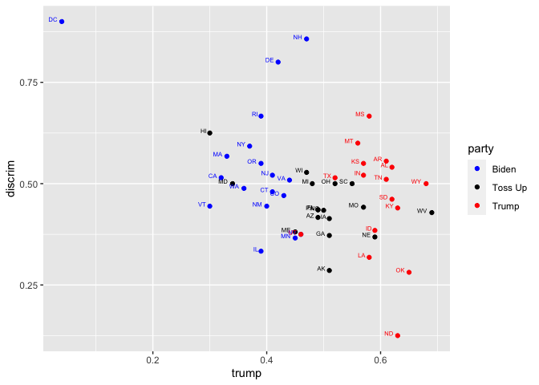

A Quick Analysis on the 2020 Election
================
Jay Kim

``` r
library(dplyr)
```

    ## 
    ## Attaching package: 'dplyr'

    ## The following objects are masked from 'package:stats':
    ## 
    ##     filter, lag

    ## The following objects are masked from 'package:base':
    ## 
    ##     intersect, setdiff, setequal, union

``` r
library(ggplot2)
library(tidyverse)
```

    ## ── Attaching packages ────────────────────────────────────────────────────────────────────── tidyverse 1.3.0 ──

    ## ✓ tibble  3.0.3     ✓ purrr   0.3.4
    ## ✓ tidyr   1.1.2     ✓ stringr 1.4.0
    ## ✓ readr   1.3.1     ✓ forcats 0.5.0

    ## ── Conflicts ───────────────────────────────────────────────────────────────────────── tidyverse_conflicts() ──
    ## x dplyr::filter() masks stats::filter()
    ## x dplyr::lag()    masks stats::lag()

``` r
library(janitor)
```

    ## 
    ## Attaching package: 'janitor'

    ## The following objects are masked from 'package:stats':
    ## 
    ##     chisq.test, fisher.test

``` r
library(readr)
week4_hw_data <- read_csv("week4-hw-data.csv")
```

    ## Warning: Missing column names filled in: 'X1' [1]

    ## Parsed with column specification:
    ## cols(
    ##   X1 = col_double(),
    ##   state = col_character(),
    ##   trump = col_double(),
    ##   discrim = col_double()
    ## )

# Graph 1

``` r
ggplot(week4_hw_data, aes(x=trump, y=discrim))+
  geom_point(col="blue",size = 1.5)+
  scale_x_continuous(breaks = seq(0, 1, 0.1), labels= function(x){paste0(x*100, '%')})+
  scale_y_continuous(breaks = seq(0, 1, 0.1), labels= function(x){paste0(x*100, '%')})+ #how to do this correctly
  labs(x = "2016 Trump vote",
       y = "% saying discrimination")+
  #geom_text(aes(label= ifelse(trump<.2, as.character(state), ''),),hjust=1.2, vjust =0)+
  #geom_text(aes(label= ifelse(discrim<.2, as.character(state), '')), hjust=1.2, vjust =0)+
  geom_abline(slope=-0.8, intercept = 0.9)+
  theme_bw()
```

<!-- -->

This graph is misleading becase if you were to take out the leftmost and
right/bottom most outlier and made the x and y axis of the same length,
the graph would have little to no downward trend. I do think a relation
exists, just maybe not as dramatic as the graph may portray. To get a
more accurate relationship, we could make the graph axis of equal
length.

# Graph 2

``` r
week4_hw_data$party <- ifelse(week4_hw_data$state %in% c("CA", "NY","WA", "OR","NV","CO","NM","MN","IL","VA","MA", "RI", "CT", "NJ", "DE", "DC", "VT", "NH" ), 'Biden',      
                       ifelse(week4_hw_data$state %in% c("ID", "MT", "WY", "UT", "ND", "SD", "KS", "OK", "TX", "AR", "LA", "MS", "AL", "TN", "KY", "IN", "WY" ), 'Trump', "Toss Up"))
week4_hw_data %>% 
  ggplot(aes(x= trump, y= discrim, col= party))+
  geom_point()+
  geom_text(aes(label= ifelse(trump<1, as.character(state), ''),),hjust=1.5, vjust =0, size =2)+
  scale_colour_manual(values =c("blue", "black","red"))
```

<!-- -->

With this year’s election so close, in this graph I have specified which
states are leaning towards electing which president based on the recent
polls. While the results are unsurprising, it is interesting to see
visually what is going happening. What is also unsurprising is that the
states leaning Trump tend to think discrimination is less prevalent, and
the states leaning Biden seem to think the it is more prevalent. There
could be a few explanations to why this may be, but that could be a
conversation for another time.
