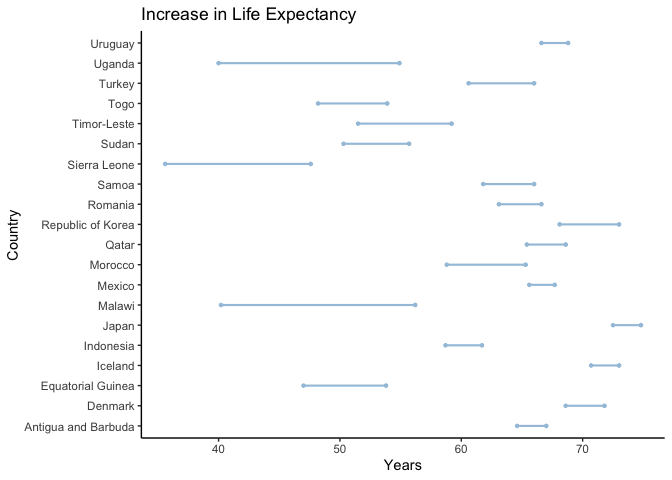
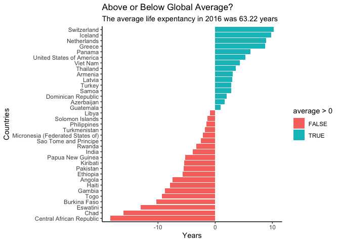

Analysis on Life Expectancy
================
Jay Kim

# Part One

This data set contains a lot of information on life expectancy in many
many different countries across the globe. The World Health
Organization, more commonly referred to as ‘WHO’, began procuring annual
life tables for all Member States in 1999. These life tables are a basic
input to all WHO estimates of global, regional and country-level
patterns and trends in all-cause and cause-specific mortality. The WHO
then published these life expectancy estimates for 194 countries total
between the years of 2000 and 2015. The WHO seemed to have collected
this data for a few reasons. They wanted to see any chances in mortality
rates within different countries and how it changed over the course of
several years- if at all. They wanted to see if gender played a role in
life expectancy or current event during certain times, like the AIDS
epidemic.

# Part Two

My motivating question is, which countries have the highest in life
expentancy and which have the lowest? Have all countries increased these
numbers in the past several years? If no, which haven’t?

``` r
library(readr)
library(tidyverse)
library(janitor)
```

``` r
life <- read_csv("life_data.csv") %>% #Adjusting variable names in data set
clean_names()
```

``` r
library(ggplot2)
library(ggalt)
```

    ## Registered S3 methods overwritten by 'ggalt':
    ##   method                  from   
    ##   grid.draw.absoluteGrob  ggplot2
    ##   grobHeight.absoluteGrob ggplot2
    ##   grobWidth.absoluteGrob  ggplot2
    ##   grobX.absoluteGrob      ggplot2
    ##   grobY.absoluteGrob      ggplot2

``` r
library(tidyverse)
theme_set(theme_classic())
```

Graph 1: This graph first randomly selects 20 countries to plot. It then
plots how the life expectancy in that coutnry increased from the years
2000 to 2016.

``` r
df <- sample_n(life, size = 20) #randomly selecting 20 countries
df
```

    ## # A tibble: 20 x 16
    ##    country both_sexes_2016 both_sexes_2015 both_sexes_2010 both_sexes_2005
    ##    <chr>             <dbl>           <dbl>           <dbl>           <dbl>
    ##  1 Uganda             54.9            54.5            50.4            45.5
    ##  2 Uruguay            68.8            68.7            68              67.3
    ##  3 Turkey             66              65.6            64.4            62.6
    ##  4 Qatar              68.6            68.3            66.7            66.1
    ##  5 Malawi             56.2            55.5            50.4            43.5
    ##  6 Indone…            61.7            61.5            60.4            59.7
    ##  7 Republ…            73              72.7            71.4            69.9
    ##  8 Togo               53.9            53.5            51.1            48.8
    ##  9 Samoa              66              65.7            64.4            63.1
    ## 10 Japan              74.8            74.7            73.8            73.2
    ## 11 Equato…            53.8            53.6            51.2            48.6
    ## 12 Morocco            65.3            65              63.5            61.4
    ## 13 Sudan              55.7            55.4            54              52.5
    ## 14 Sierra…            47.6            46              43.9            39.4
    ## 15 Romania            66.6            66.3            65.2            64  
    ## 16 Antigu…            67              66.9            66.5            65.4
    ## 17 Denmark            71.8            71.5            70.4            69.6
    ## 18 Mexico             67.7            67.4            66.5            66.2
    ## 19 Timor-…            59.2            58.6            57.3            55  
    ## 20 Iceland            73              73              72.6            71.9
    ## # … with 11 more variables: both_sexes_2000 <dbl>, male_2016 <dbl>,
    ## #   male_2015 <dbl>, male_2010 <dbl>, male_2005 <dbl>, male_2000 <dbl>,
    ## #   female_2016 <dbl>, female_2015 <dbl>, female_2010 <dbl>, female_2005 <dbl>,
    ## #   female_2000 <dbl>

``` r
gg <- ggplot(df, aes(y=country, x = both_sexes_2000, xend = both_sexes_2016)) + 
        geom_dumbbell(color="#a3c4dc", 
                      size=0.75, 
                      point.colour.l="#0e668b") +
  labs(title = "Increase in Life Expectancy", 
       x = "Years",
       y = "Country")
```

    ## Warning: Ignoring unknown parameters: point.colour.l

``` r
geom_segment(data = life, aes(y=concerned, yend=concerned, x=20, xend=100), color="#b2b2b2", size=0.15)
```

    ## mapping: x = 20, y = ~concerned, yend = ~concerned, xend = 100 
    ## geom_segment: arrow = NULL, arrow.fill = NULL, lineend = butt, linejoin = round, na.rm = FALSE
    ## stat_identity: na.rm = FALSE
    ## position_identity

``` r
gg
```

<!-- -->

Graph 2 First, we had to do some data manipulation. We computed the mean
and then created a new column with the difference in life expectancy
from 2016 and the mean, we called the column “average”.

``` r
diff_life <- life %>%  #Adding a new column that contains the country's deviation in life expectancy from the global average
  mutate(average = both_sexes_2016 - mean(both_sexes_2016))%>%
  select(country, both_sexes_2016, average)
diff_life
```

    ## # A tibble: 183 x 3
    ##    country             both_sexes_2016 average
    ##    <chr>                         <dbl>   <dbl>
    ##  1 Afghanistan                    53    -10.2 
    ##  2 Albania                        68.1    4.87
    ##  3 Algeria                        65.5    2.27
    ##  4 Angola                         55.8   -7.43
    ##  5 Antigua and Barbuda            67      3.77
    ##  6 Argentina                      68.4    5.17
    ##  7 Armenia                        66.3    3.07
    ##  8 Australia                      73      9.77
    ##  9 Austria                        72.4    9.17
    ## 10 Azerbaijan                     64.9    1.67
    ## # … with 173 more rows

The average life exptectancy is computed below.

``` r
life %>%
  summarise(mean(both_sexes_2016)) #Global mean of life expectancy
```

    ## # A tibble: 1 x 1
    ##   `mean(both_sexes_2016)`
    ##                     <dbl>
    ## 1                    63.2

``` r
df <- sample_n(diff_life, size = 35)
df
```

    ## # A tibble: 35 x 3
    ##    country          both_sexes_2016 average
    ##    <chr>                      <dbl>   <dbl>
    ##  1 India                       59.3   -3.93
    ##  2 Azerbaijan                  64.9    1.67
    ##  3 Solomon Islands             61.9   -1.33
    ##  4 Samoa                       66      2.77
    ##  5 Turkmenistan                61.4   -1.83
    ##  6 Papua New Guinea            58     -5.23
    ##  7 Togo                        53.9   -9.33
    ##  8 Panama                      69.4    6.17
    ##  9 Kiribati                    57.8   -5.43
    ## 10 Greece                      72      8.77
    ## # … with 25 more rows

``` r
ggplot(df, 
       aes(x = reorder(country, average ), y = average,
           fill = average >0))+
  geom_bar(stat = "identity")+
  coord_flip()+
  labs(x = "Countries", y="Years",
       title = "Above or Below Global Average?",
       subtitle = "The average life expentancy in 2016 was 63.22 years ")
```

<!-- -->
Because there are so many countries, I needed a graph that would best
show the differences in each country. Plotting either a scatter plot or
line graph with multiple countries in 1 graph seemed inefficient, and so
I thought these two graphs did that best. My first graph is to analyze
the increases in life expectancies of 20 randomly selected countries. My
second graph is the see how 35 randomly selected countries’ life
expectancy compare to the global average: 63.22 years. If a country’s
expectancy was 67 for example, then it was show that that it was 4 years
above average.

# Part Four

We can see a few things. First, we see that countries such as Italy,
France, and New Zealand have particularly high life expectancy, while
Sierra Leone and Lesotho have quite low ones. Countries in Europe and
North America have much higher life expectancy on average than countries
in Southeast Asia and parts of Africa.
