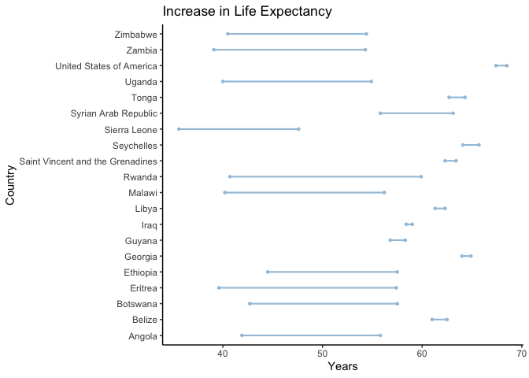
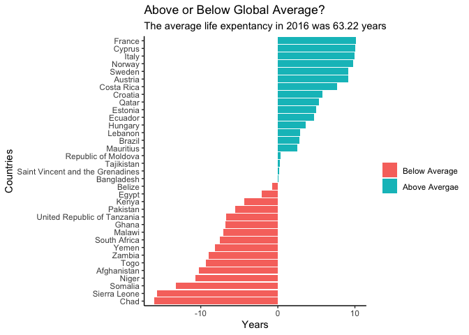
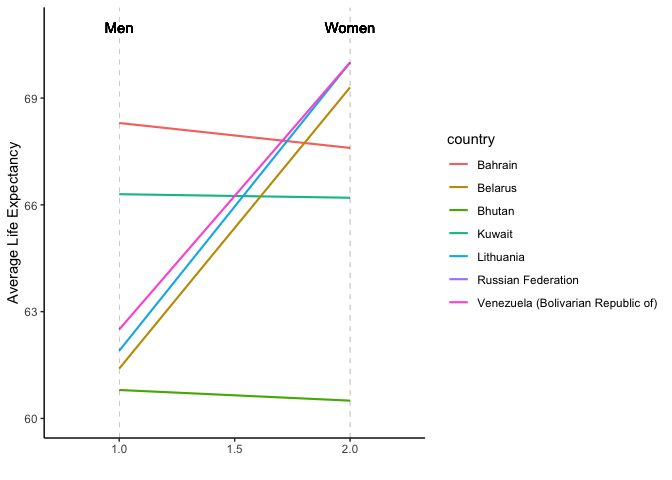

Analysis on Life Expectancy
================
Jay Kim

# Part One: Introduction

This data set contains a lot of information on life expectancy in many
many different countries across the globe. The World Health
Organization, more commonly referred to as ‘WHO’, began procuring annual
life tables for all Member States in 1999. These life tables are a basic
input to all WHO estimates of global, regional and country-level
patterns and trends in all-cause and cause-specific mortality. The WHO
then published these life expectancy estimates for 194 countries total
between the years of 2000 and 2015. The WHO seemed to have collected
this data for a few reasons. They wanted to see any chances in mortality
rates within different countries and how it changed over the course of
several years- if at all. They wanted to see if gender played a role in
life expectancy or current event during certain times, like the AIDS
epidemic.

``` r
library(readr)
library(tidyverse)
library(janitor)
library(maps)
library(ggplot2)
library(ggalt)
theme_set(theme_classic())
world = map_data("world")
```

``` r
life <- read_csv("life_data.csv") %>% #Adjusting variable names in data set
clean_names()
life
```

    ## # A tibble: 183 x 16
    ##    country both_sexes_2016 both_sexes_2015 both_sexes_2010 both_sexes_2005
    ##    <chr>             <dbl>           <dbl>           <dbl>           <dbl>
    ##  1 Afghan…            53              53.2            51.6            49.6
    ##  2 Albania            68.1            67.8            66.4            65.4
    ##  3 Algeria            65.5            65.3            64.5            62.8
    ##  4 Angola             55.8            55.3            51.8            46.7
    ##  5 Antigu…            67              66.9            66.5            65.4
    ##  6 Argent…            68.4            68.2            67.3            66.7
    ##  7 Armenia            66.3            66              65.2            64.7
    ##  8 Austra…            73              72.7            72.2            71.4
    ##  9 Austria            72.4            72.1            71.4            70.6
    ## 10 Azerba…            64.9            64.6            63.4            61.5
    ## # … with 173 more rows, and 11 more variables: both_sexes_2000 <dbl>,
    ## #   male_2016 <dbl>, male_2015 <dbl>, male_2010 <dbl>, male_2005 <dbl>,
    ## #   male_2000 <dbl>, female_2016 <dbl>, female_2015 <dbl>, female_2010 <dbl>,
    ## #   female_2005 <dbl>, female_2000 <dbl>

# Graph \#1

This graph first plots the 10 countries where there was the greatest
increase in life expectancy and the the 10 countries with the smallest
increase of life expectancy(including any decreases as well) from the
years 2000 to 2016. But before we can do so, we need to create a dataset
that contains the a column with the value of the difference between the
life ex. from the time interval 2016 and 2000. We will then we will
select the necessary 20 rows.

``` r
new_life<- life%>%
  mutate(increase=both_sexes_2016 - both_sexes_2000)%>%
  select(country, increase, both_sexes_2016, both_sexes_2000)%>%
  arrange(desc(increase))%>%
  slice(tail(row_number(),(10)), head(row_number(),10))
new_life
```

    ## # A tibble: 20 x 4
    ##    country                          increase both_sexes_2016 both_sexes_2000
    ##    <chr>                               <dbl>           <dbl>           <dbl>
    ##  1 Seychelles                           1.6             65.7            64.1
    ##  2 Tonga                                1.60            64.3            62.7
    ##  3 Belize                               1.5             62.5            61  
    ##  4 Guyana                               1.5             58.3            56.8
    ##  5 Saint Vincent and the Grenadines     1.1             63.4            62.3
    ##  6 United States of America             1.10            68.5            67.4
    ##  7 Libya                                1               62.3            61.3
    ##  8 Georgia                              0.9             64.9            64  
    ##  9 Iraq                                 0.6             59              58.4
    ## 10 Syrian Arab Republic                -7.3             55.8            63.1
    ## 11 Rwanda                              19.2             59.9            40.7
    ## 12 Eritrea                             17.8             57.4            39.6
    ## 13 Malawi                              16               56.2            40.2
    ## 14 Zambia                              15.2             54.3            39.1
    ## 15 Uganda                              14.9             54.9            40  
    ## 16 Botswana                            14.8             57.5            42.7
    ## 17 Angola                              13.9             55.8            41.9
    ## 18 Zimbabwe                            13.9             54.4            40.5
    ## 19 Ethiopia                            13               57.5            44.5
    ## 20 Sierra Leone                        12               47.6            35.6

``` r
ggplot(new_life, aes(y=country, x = both_sexes_2000, xend = both_sexes_2016)) + 
        geom_dumbbell(color="#a3c4dc", 
                      size=0.75, 
                      point.colour.l="#0e668b") +
  labs(title = "Increase in Life Expectancy", 
       x = "Years",
       y = "Country")
```

    ## Warning: Ignoring unknown parameters: point.colour.l

<!-- -->

``` r
geom_segment(data = life, aes(y=concerned, yend=concerned, x=20, xend=100), color="#b2b2b2", size=0.15)
```

    ## mapping: x = 20, y = ~concerned, yend = ~concerned, xend = 100 
    ## geom_segment: arrow = NULL, arrow.fill = NULL, lineend = butt, linejoin = round, na.rm = FALSE
    ## stat_identity: na.rm = FALSE
    ## position_identity

We see that all countries saw an increase but one (if you look at the
last entry), the Syrain Arab Republic. They had a decrease in life ex.
by 7.3 years.

# Graph 2

First, we had to do some data manipulation. We computed the mean and
then created a new column with the difference in life expectancy from
2016 and the mean, we called the column “average”.

``` r
diff_life <- life %>%  #Adding a new column that contains the country's deviation in life expectancy from the global average
  mutate(average = both_sexes_2016 - mean(both_sexes_2016))%>%
  select(country, both_sexes_2016, average)
diff_life
```

    ## # A tibble: 183 x 3
    ##    country             both_sexes_2016 average
    ##    <chr>                         <dbl>   <dbl>
    ##  1 Afghanistan                    53    -10.2 
    ##  2 Albania                        68.1    4.87
    ##  3 Algeria                        65.5    2.27
    ##  4 Angola                         55.8   -7.43
    ##  5 Antigua and Barbuda            67      3.77
    ##  6 Argentina                      68.4    5.17
    ##  7 Armenia                        66.3    3.07
    ##  8 Australia                      73      9.77
    ##  9 Austria                        72.4    9.17
    ## 10 Azerbaijan                     64.9    1.67
    ## # … with 173 more rows

The average life exptectancy is computed below.

``` r
life %>%
  summarise(mean(both_sexes_2016)) #Global mean of life expectancy
```

    ## # A tibble: 1 x 1
    ##   `mean(both_sexes_2016)`
    ##                     <dbl>
    ## 1                    63.2

``` r
df <- sample_n(diff_life, size = 35)
df
```

    ## # A tibble: 35 x 3
    ##    country    both_sexes_2016  average
    ##    <chr>                <dbl>    <dbl>
    ##  1 Bangladesh            63.3   0.0732
    ##  2 Croatia               69     5.77  
    ##  3 Mauritius             65.8   2.57  
    ##  4 Ghana                 56.4  -6.83  
    ##  5 Zambia                54.3  -8.93  
    ##  6 Chad                  47.2 -16.0   
    ##  7 Togo                  53.9  -9.33  
    ##  8 Cyprus                73.3  10.1   
    ##  9 Italy                 73.2   9.97  
    ## 10 Brazil                66     2.77  
    ## # … with 25 more rows

``` r
ggplot(df, 
       aes(x = reorder(country, average ), y = average,
           fill = average >0))+
  geom_bar(stat = "identity")+
  coord_flip()+
  labs(x = "Countries", y="Years",
       title = "Above or Below Global Average?",
       subtitle = "The average life expentancy in 2016 was 63.22 years ")+
  scale_fill_discrete(name = "", labels = c("Below Average", "Above Avergae"))
```

<!-- -->
We can see a few things here. This graph shows how 35 randomly selected
countries’ life expectancy compare to the global average: 63.22 years.
If a country’s expectancy was 67 for example, then it was show that that
it was 4 years above average.Countries in Europe and North America have
much higher life expectancy on average than countries in Southeast Asia
and parts of Africa. This could be a result in the differences of living
in a more developed country versus a developing country. Developing
countries, such as those in Sub-Saharan Africa, deal with issues that
places such as Switzerland, Norway, and Italy do not: famine, low level
of education, availability of clean water, among many others. Developed
countries not only do not have to worry as much about issues like those,
but also have improved and robust medical care in place in case their
citizens fall ill. 

# Graph 3

``` r
library(ggplot2)
library(scales)
```

    ## 
    ## Attaching package: 'scales'

    ## The following object is masked from 'package:purrr':
    ## 
    ##     discard

    ## The following object is masked from 'package:readr':
    ## 
    ##     col_factor

``` r
theme_set(theme_classic())
```

In the code below we want to see the difference in life expectancy
between women and men in each country and then arrange them in
descending order. If the difference (stored in ‘diff’) is positive, then
it means that in that country, women have a higher life expectancy.

``` r
life3 <- life%>%
  select(male_2016, female_2016, country)%>%
  mutate(diff = female_2016 - male_2016)%>%
  arrange(desc(diff))
life3
```

    ## # A tibble: 183 x 4
    ##    male_2016 female_2016 country                             diff
    ##        <dbl>       <dbl> <chr>                              <dbl>
    ##  1      59.1        67.5 Russian Federation                  8.40
    ##  2      61.9        70   Lithuania                           8.1 
    ##  3      61.4        69.3 Belarus                             7.90
    ##  4      62.5        70   Venezuela (Bolivarian Republic of)  7.5 
    ##  5      61.7        69   El Salvador                         7.30
    ##  6      62.2        69.5 Seychelles                          7.30
    ##  7      60.3        67.6 Ukraine                             7.30
    ##  8      62.4        69.5 Latvia                              7.1 
    ##  9      52.5        59.5 Syrian Arab Republic                7   
    ## 10      61.5        68.4 Georgia                             6.9 
    ## # … with 173 more rows

Russian Federation, Lithuania, and Belarus has the highest difference of
about 8 years- which is a big difference\! We can then look at the last
few entries of this data set which will tell us the countries that have
the biggest gaps but with men with the high life expectancy. We will
graph the top 3 from both ends of the dataset below to analyze. But
quickly, we will create a dataset that contains these 6 values.

``` r
Big_Diff <- life3%>%
  slice(tail(row_number(),3), head(row_number(),4))
Big_Diff
```

    ## # A tibble: 7 x 4
    ##   male_2016 female_2016 country                              diff
    ##       <dbl>       <dbl> <chr>                               <dbl>
    ## 1      66.3        66.2 Kuwait                             -0.100
    ## 2      60.8        60.5 Bhutan                             -0.300
    ## 3      68.3        67.6 Bahrain                            -0.7  
    ## 4      59.1        67.5 Russian Federation                  8.40 
    ## 5      61.9        70   Lithuania                           8.1  
    ## 6      61.4        69.3 Belarus                             7.90 
    ## 7      62.5        70   Venezuela (Bolivarian Republic of)  7.5

``` r
#how to add color by country
#How to hide code
#Is adding 1 graph enough?
Big_Diff
```

    ## # A tibble: 7 x 4
    ##   male_2016 female_2016 country                              diff
    ##       <dbl>       <dbl> <chr>                               <dbl>
    ## 1      66.3        66.2 Kuwait                             -0.100
    ## 2      60.8        60.5 Bhutan                             -0.300
    ## 3      68.3        67.6 Bahrain                            -0.7  
    ## 4      59.1        67.5 Russian Federation                  8.40 
    ## 5      61.9        70   Lithuania                           8.1  
    ## 6      61.4        69.3 Belarus                             7.90 
    ## 7      62.5        70   Venezuela (Bolivarian Republic of)  7.5

``` r
p <- ggplot(Big_Diff, aes(x=1, xend=2, y= male_2016, yend=female_2016, colour=country)) + 
  geom_segment(size=.75, show.legend=T) +
  geom_vline(xintercept=1, linetype="dashed", size=.1) +
  geom_vline(xintercept=2, linetype="dashed", size=.1) +
  labs(x="", y="Average Life Expectancy") +
  xlim(0.75, 2.25) + ylim(60,71)+   # X and Y axis limits 
 geom_text(label="Men", x=1, y=71, color="Black")+
  geom_text(label="Women", x=2, y=71, color="Black")
p
```

    ## Warning: Removed 1 rows containing missing values (geom_segment).

<!-- -->
Interestingly, the top countries where the women live longer live a lot
longer than the top countries where men live longer. We may have only
graphed 3 countries from both criteria, but if you were to go back and
look at the life3 data set, most of the values in the ‘diff’ column are
indeed positive, meaning the women live longer

``` r
life3%>%
  summarise(mean(diff))
```

    ## # A tibble: 1 x 1
    ##   `mean(diff)`
    ##          <dbl>
    ## 1         3.26

Just out of curiosity I calculated the average difference between all
countries, and it comes out to be 3.26 years.
